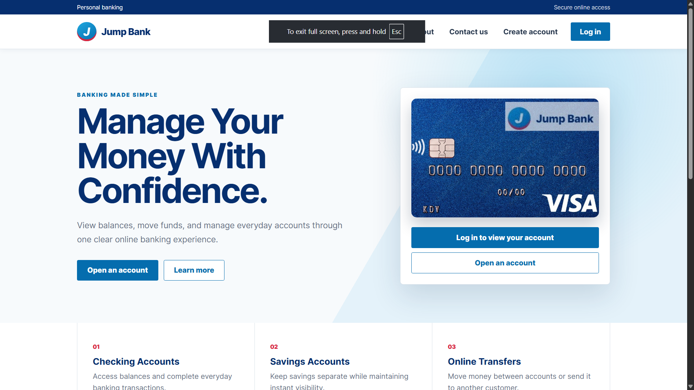
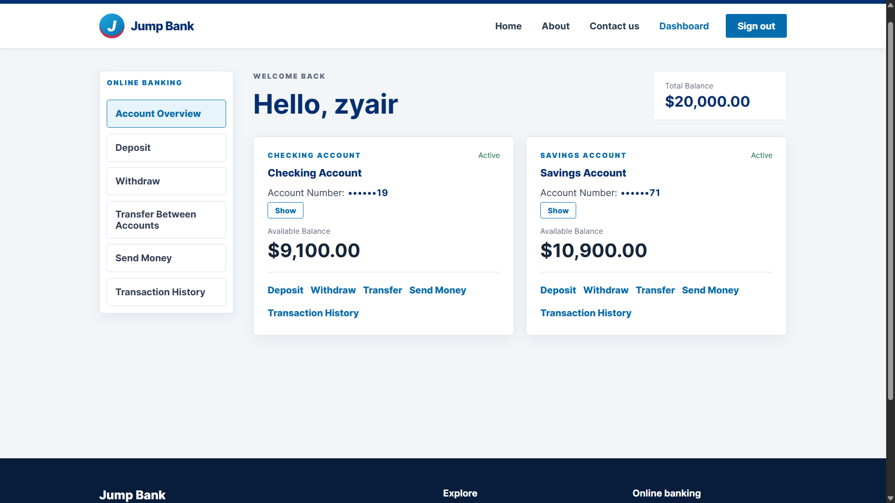
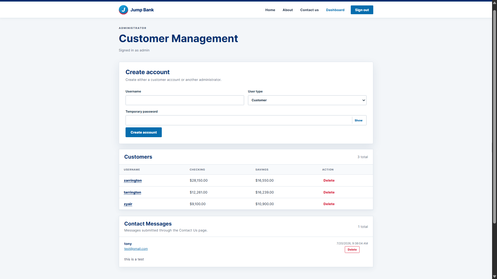

# Jump Banking System

A full-stack banking application developed as a progression from a Java console application to a modern web application. This repository demonstrates the evolution of the project through multiple development stages, including object-oriented programming, REST API development, secure authentication, cloud deployment, and a React frontend.

## Project Overview

The Jump Banking System allows users to create accounts, securely log in, manage their finances, and perform common banking operations through a modern web interface. The backend is built with Spring Boot and MongoDB Atlas, while the frontend is developed using React and Vite.

## Repository Structure

This repository is organized into multiple branches, each representing a major stage of development.

| Branch | Description |
|---------|-------------|
| **console-app** | Original Java console banking application using object-oriented programming. |
| **Rest-API** | Spring Boot REST API with MongoDB, JWT authentication, and Spring Security. |
| **Fullstack-Frontend** | React frontend that communicates with the REST API and provides a complete user interface. |

## Features

### Customer Features

- Create customer accounts
- Secure login with JWT authentication
- View account balances
- Deposit funds
- Withdraw funds
- Transfer between checking and savings
- Send money
- View transaction history
- Contact administrators

### Administrator Features

- Secure administrator login
- View all customer accounts
- Create customer and administrator accounts
- Delete customer accounts
- View contact messages
- Manage banking users

## Technologies Used

### Frontend

- React
- Vite
- React Router
- Axios
- CSS

### Backend

- Java 21
- Spring Boot
- Spring Security
- Spring Data MongoDB
- JWT Authentication
- Maven

### Database

- MongoDB Atlas

### Deployment

- AWS EC2
- Ubuntu
- Nginx Reverse Proxy

## Security Features

- JWT Authentication
- BCrypt password hashing
- Role-based authorization
- Stateless authentication
- Protected REST API endpoints
- Spring Security integration

## Project Evolution

The project was developed in three major phases:

### Phase 1 – Console Application

A Java command-line banking system built using object-oriented programming concepts.

### Phase 2 – REST API

The business logic was converted into a secure REST API using Spring Boot, MongoDB, and JWT authentication.

### Phase 3 – Full Stack Web Application

A React frontend was created to communicate with the REST API, providing users with a modern banking experience that was later deployed to AWS.

## Screenshots

### Home Page



### Customer Dashboard



### Administrator Dashboard



## Running the Project

Each branch contains its own detailed setup instructions.

1. Clone the repository

```bash
git clone https://github.com/yanarex/JumpFullStack_2026July13.git
```

2. Checkout the desired branch

```bash
git checkout Rest-API
```

or

```bash
git checkout Fullstack-Frontend
```

Refer to each branch's README for installation and configuration instructions.

## Future Improvements

- HTTPS with SSL certificates
- Docker containerization
- Continuous Integration / Continuous Deployment (CI/CD)
- Password reset via email
- Two-factor authentication
- Mobile application
- Account statements and PDF exports

## Author

**Tony Arrington**

---

This project was developed to demonstrate full-stack software engineering concepts, including object-oriented programming, REST API development, secure authentication, cloud deployment, and modern frontend development.
